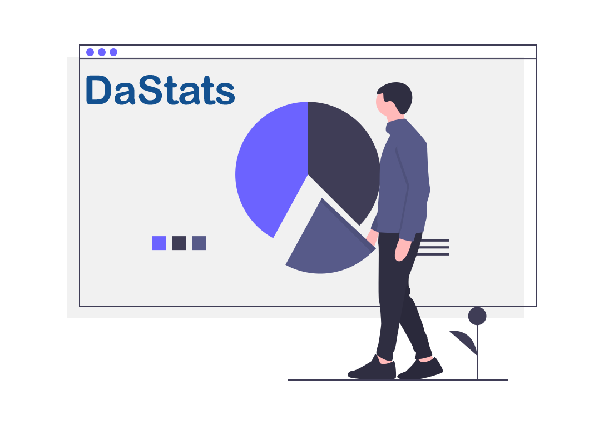
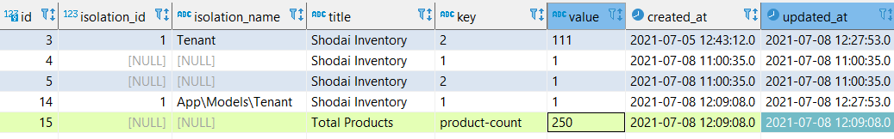

# Da Stats

This package is a lightweight solution to record and view the statistics for the dashboard or reports. Sometimes we need **KPI** / **Metrics** / **Statistics** in our **Dashboard** Or **Reports**, to create those statistics we need to go through lots of calculation, queries etc. But this package may helps you to make statistics in nicer way, the statistics stored in a **single db table**, so it would be faster or easier to retrieve.

# Examples
Lots of dashboard or reports have statistic widget like total customer, total user, total pending orders, total sales etc.
For these **statistic widgets** we applied query across tables, rows along with mathematical equation to get the single
unified numeric value. For small database the approach is ok but for large database the calculation may hamper the performance or create complexity. So what if
we could calculate the statistics during the **CRUD operation**.

### Examples 1:

**Total User Counting:** 

Increase a user whenever a new user is store, Decrease a user whenever user delete.

    use RadiateCode\DaStats\Facades\Stats;
    .......
    
    public function storeUser(Request $request){
        // stores statements
        ............

        Stats::title('User count')->key('total-user')->increase();
    }

    public function deleteUser($id){
        // delete statements
        ............

        Stats::key('total-user')->decrease();
    }

### Examples 2:

**Total Pending Orders:**

Increase or count total pending order whenever a new pending order placed, Decrease total pending order 
whenever an order successfully delivered.

    use RadiateCode\DaStats\Facades\Stats;
    .......
    
    public function orderStore(Request $request){
	    // pending order placement statements
        ............
    
        Stats::title('Pending order count')->key('total-pending-order')->increase();
    }
    
    public function orderDeliver(Request $request){
        // order delivery statements
        ............
        
        Stats::key('total-pending-order')->decrease();
    }
### Examples 3:

**Product Stocks:**

Increase product stock whenever new products purchased, 

    use RadiateCode\DaStats\Facades\Stats;
    .......

    public function purchaseStore(Request $request){
	    // other statements
    	............

        foreach($purchaseProducts as $product){ // multiple products
            // purchase products save statements
            ..............
            
            // increase stock for a product
            Stats::title('Live stock')->key($product->id)->increase($product->quantity);
        }
    }

**Update product stock:** sometime we need to update purchase product quantity for example quantity add or subtract in the same view, in that case our 
**product stock** also need to reflect accordingly.

    use RadiateCode\DaStats\Facades\Stats;
    .......

    public function purchaseUpdate(Request $request){
	    // other statement
    	............

        foreach($purchaseProducts as $product){
            // purchase products update statements
            ..............
            ..............

            //live stock
            $variation = (int) $newQty - $oldQty;

            Stats::when($variation > 0,function ($stats) use ($product,$variation){
                $stats->title('Live stock')->key($product->id)->increase($variation);
            });

            Stats::when($variation < 0,function ($stats) use ($product,$variation){
                $stats->title('Live stock')->key($product->id)->decrease(abs($variation));
            });
        }
    }

Decrease product stock whenever a purchase product is delete.

    use RadiateCode\DaStats\Facades\Stats;
    .......

    public function productDelete($id){
	    // other statement
    	............
    
        // find product
        $purchaseProduct = PurchaseProduct::findOrFail($id);

        // decrese value for this product
        Stats::title('Live stock')->key($purchaseProduct->id)->decrease($purchaseProduct->quantity);

        $purchaseProduct->delete(); // purchase product delete
    }

### Get the statistics

Above examples have shown us that how we can create stats by placing increase(), decrease() or replace() inside data **CRUD operations**.

Now let's get or view our stats.

    $stats = Stats::key('total-pending-order')->find();
    
    $stats = Stats::key('total-user')->find();

    $stock = Stats::title('Live stock')->get();

or

    $stats = Stats::inKeys('total-pending-order','total-user')->get();
    
    // get stock by product ids
    $stocks = Stats::inKeys(1,22,55,66)->get(); 

## Installation
You can install the package via composer:

    composer require radiatecode/dastats

Migrate the stats table

    php artisan dastats:table

    php artisan migrate

You can publish config file (optional)

    php artisan vendor:publish --provider="RadiateCode\DaStats\StatsServiceProvider" --tag="dastats-config"

## Usages

####  Stats increase:
Increase stats for given key and title.

    Stats::title('Your Title')->key('your-key')->increase(); 

> Increase by **default 1**, But you can pass any specific numerical value.

> Under the hood **increase()** check is there any stats exits for the given key & title, if yes it will increment, if not it will create new record

####  Stats decrease:

Decrease stats value for given key.

    Stats::key('your-key')->decrease();

or

	Stats::title('Your Title')->key('your-key')->decrease();

> Decrease method decrease a stats by **1 (default)**, But you can decrease by any specific value.

> Under the hood **decrease()** checks stats existence, if found it will decrement otherwise return null. During decrement if the decrement comes at zero it will delete the stats record from the storage.

### Stats replace:

In some situation we don't need to increase or decrease we just need to update stats value, in that case we can use **replace()** function

    Stats::title('Your Title')->key('your-key')->replace(8000);

> Under the hood **replace()** check is there any stats exits with given key & title, if yes it will update the value otherwise return false. 
>> 2nd argument of **replace()** also allow us to create new record if no record found for the given key / title.

###  Find Stats:
**Get stats by keys**

    Stats::inKeys('key-1','key-2')->get();

**Paginate**

    Stats::inKeys('key-1','key-2')->paginate(10);

**Find single stats**

    Stats::title('Title 1')->key('key-1')->find();
or

       Stats::key('key-1')->find();

###  Remove stats:

    $stats = Stats::key('key-1')->remove();

or

	Stats::inKeys('key-1','key-2','key-3')->remove();

###  Isolate stats:
Isolation can be useful for SaaS applications, certain stats can be stored for individual user or organisation or tenant.

    Stats::isolate('Tenant',101)->title('Total Order')->key('order-count')->increment();

    Stats::isolate('Tenant',101)->key('order-count')->find();
or

    Stats::isolate('User',202)->title('Complete Project')->key('project-completion')->increment();
    
    Stats::isolate('User',202)->key('project-completion')->find();

###  Conditional operation:

    Stats::when($some_condition,function($stats){
        return $stats->title('Title 1')->key('key-1')->increase(8000);
    });

or

    Stats::title('Title 1')->key('key-1')
    ->when($some_condition,
        function($stats){ // when condition true
            return $stats->decrease(2500);
        },function(){ // when condition false
            return $stats->increase(500); 
        }
    );

or

    Stats::when($has_tenant,function($stats) use ($tenantId){
        return $stats->isolate('Tenant', $tenantId);
    })->all();

### Multiple increase or decrease or replace

For multiple increase or decrease or replace we can use **doMany()**
    
    use RadiateCode\DaStats\Enum\StatsAction;
    ...........

    // data format
    $data =  [
        ['key' => 'key-1','value' = 40],
        ['key' => 'key-2','value' = 25],
        ['key' => 'key-3','value' = 35],
    ]

    // action (ex: StatsAction::INCREASE, StatsAction::DECREASE, StatsAction::REPLACE)
    $action = StatsAction::INCREASE

    Stats::title('Live stock')->doMany($action,$data);

**when required isolation**

    // data format
    $data =  [
        ['key' => 'key-1','value' = 40],
        ['key' => 'key-2','value' = 25],
        ['key' => 'key-3','value' = 35],
    ]

    Stats::isolate('Organisation',$organisaiton->id)->title('Live stock')->doMany(StatsAction::INCREASE,$data);

> **Note:** Data format should be followed as the example.

So In example 3 we see that increase operation used inside purchase products loop, but now we can use **doMany()** to do multiple increase by passing an array which contain product id and quantity

    Stats::title('Live stock')->doMany(
        StatsAction::INCREASE,
        [
            ['key' => 1,'value' = 500], // key => product id and value => quantity
            ['key' => 5,'value' = 152],
            ['key' => 35,'value' = 7569],
            ['key' => 7,'value' = 900],
            ['key' => 9,'value' = 25],
        ]
    );

### Jobs
Sometimes we need to queue our stats so that it can run in the background without delaying user response, so in that case we can use predefined jobs.

> **Note:** make sure we have configured [Laravel Queue](https://laravel.com/docs/8.x/queues) and run the queue worker

**Single stats job:** 

    use RadiateCode\DaStats\Jobs\SingleStatsJob;
    use RadiateCode\DaStats\Enum\StatsAction;
    ..........

    // dispatch the job to increase a stats
    dispatch(new SingleStatsJob(StatsAction::INCREASE,'Title','key',value));

    or

    // dispatch the job to decrease a stats
    dispatch(new SingleStatsJob(StatsAction::DECREASE,'Title','key',value));

**Multiple stats job:**

    use RadiateCode\DaStats\Jobs\MultiStatsJob;
    use RadiateCode\DaStats\Enum\StatsAction;
    ..........

    $data = [ 
                ['key' => 1,'value' = 500],
                ['key' => 5,'value' = 152],
            ];

    // dispatch the job to decrease multiple stats value
    dispatch(new MultiStatsJob(StatsAction::DECREASE,'Title',$data));

    or 

    // dispatch the job to replace multiple stats value
    dispatch(new MultiStatsJob(StatsAction::REPLACE,'Title',$data));

> when required isolation

    use RadiateCode\DaStats\Jobs\MultiStatsJob;
    use RadiateCode\DaStats\Enum\StatsAction;
    ..........
    
    $data = [ 
                ['key' => 1,'value' = 500],
                ['key' => 5,'value' = 152],
            ];

    $job = new MultiStatsJob(StatsAction::DECREASE,'Title',$data);

    $job->withIsolation('Tenant',1001);

    dispatch($job);

### DB Table Structure

## Available methods

Stats can be call either by **Stats Facade** or **new Stats()** class

Here are available methods

|Methods         |Return                           |Note|
|----------------|---------------------------------|-----------------------------|
|`isolate(string $name,int $id)`|return stats object            |used for stats isolation            |
|`title(string $title)`    |return stats object            |set stats title            |
|`key(string $key)`          |return stats object|set stats key
| `increase(int value = 1)`				| return bool	| increase by default 1, can be pass specific numerical value
|`decrease(int value = 1) `         |return bool |decrease by default 1, can be pass any numerical value
| `replace(int $value, bool $createNew = false)` | return bool | replace existing stats value, can be create new record if no stats found by setting $createNew to true 
|`doMany(string $action, array $data)` | return bool| increase multiple data, decrease multiple data, replace multiple data
| `inKeys(...$key)` | return stats object | find stats by multiple keys
|`find()` | return mixed or eloquent collection | find specific stats
|`paginate(int $perPage = 10)` | return mixed or eloquent collection | get stats by paginate
|`get()` | return mixed or eloquent collection | get stats
|`remove()`| return true or false | remove particular stats
| `when(bool $value,callable $callback,callable $default = null)`| return stats object     | conditionally apply stats operation
| `join(string $table,string $pk,array $select = [])`| return stats object | if stats key is id of another table then join the table

## Contributing
Please see [CONTRIBUTING](CONTRIBUTING.md) for details.

## Security
If you discover any security related issues, please email [radiate126@gmail.com](mailto:radiate126@gmail.com) instead of using the issue tracker.

## Credits
- [Noor Alam](https://github.com/radiatecode)
- [All Contributors](https://github.com/radiatecode/dastats/contributors)

## License

The MIT License (MIT). Please see [License File](LICENSE.md) for more information.
