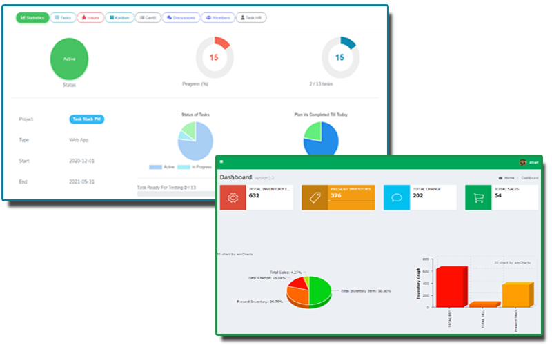

# Da Stats

This package is a lightweight solution to record and view the statistics for the dashboard or reports. Sometimes we need **KPI**/ **Matrics** / **Statistics** in our **Dashboard** Or **Reports**, to create those statistics we need to go through lots of calculation, query between tables, rows etc. But using the package helps you to make statistics in nicer way, the statistics stored in a **single db table**, so it would be faster or easier to retrieve.

# Examples
We see that lots of dashboard have statistic widget like total customer, total user, total pending orders, total sales etc.
For these statistics widget sql query apply between tables, rows and apply mathematical equation (plus, minus, count etc.) to get the single
unified numeric value. 

But now we can create our statistics easily by this package

Example:

Total User:

    use DaCode\DaStats\Facades\Stats;
    .......
    
    public function storeUser(Request $request){
		// stores statements
		............

		Stats::title('User count')->key('total-user')->increment();
    }

    public function deleteUser($id){
		// delete statements
		............

		Stats::key('total-user')->decrement();
    }

Total Pending Orders:

    use DaCode\DaStats\Facades\Stats;
    .......
    
    public function order(Request $request){
	    // pending order placement statements
    	............
    
    	Stats::title('Pending order count')->key('total-pending-order')->increment();
    }
    
    public function orderDeliver(Request $request){
		// order delivery statements
		............

		Stats::key('total-pending-order')->decrement();
    }

Get the statistics

    $stats = Stats::key('total-pending-order')->find();
    $stats = Stats::key('total-user')->find();

or

    $stats = Stats::statsByKeys('total-pending-order','total-user')->get();

## Installation
You can install the package via composer:

    composer require dacode/dastats

Migrate the stats table

    php artisan dastats:table

    php artisan migrate

You can publish config file (optional)

    php artisan vendor:publish --provider="DaCode\DaStats\StatsServiceProvider" --tag="dastats-config"

## Uses

Two type of stats stored in db such as Countable, Summation

####  Countable Stats:
Increment for the specific key and title.

    Stats::title('Your Title')->key('your-key')->increment(); 

Decrement for the specific key and title.

    Stats::key('your-key')->decrement();

or

	Stats::title('Your Title')->key('your-key')->decrement();

> *Under the hood **increment()** checks is there any stats exits in db associate with this key & title, if yes it will increment 1 with existing value, if not then it will create new record with value 1*.
> Same goes for **decrement()**, it checks  stats existence, if yes it will decrement 1 from existing value, if not then it will return null. During decrement if the decrement value comes at zero it will delete the stats record from db

####  Summation Stats:
Add value to specific key and title

    Stats::title('Your Title')->key('your-key')->addition(5000);

Subtraction value from specific key and title

    Stats::key('your-key')->subtraction(5000);

or 

    Stats::title('Your Title')->key('your-key')->subtraction(5000);

> Under the hood **addition()** and **subtraction()** does the same thing as
> **increment()** and **decrement()** does

###  Search Stats:
**Get stats by titles**

    Stats::statsByTitles('Title 1','Title 2')->get();
or
        
    Stats::statsByTitles('Title 1','Title 2')->paginate(10);

**Get stats by keys**

    Stats::statsByKeys('key-1','key-2')->get();

or

    Stats::statsByKeys('key-1','key-2')->paginate(10);
**Get stats by type**

    Stats::statsByType(StatsType::COUNTABLE)->get();

or

    Stats::statsByType(StatsType::COUNTABLE)->paginate();

**Get stats which contain the key**

    Stats::contains('key-1')->get();
or

    Stats::contains('key-1')->paginate();

**Find single stats**

    Stats::title('Title 1')->key('key-1')->find();
or

       Stats::key('key-1')->find();

**All stats**

    Stats::all();

###  Remove stats:

    $stats = Stats::key('key-1')->find();
    
    Stats::remove($stats->id);
or

	Stats::key('key-1')->remove();
###  Isolate stats:
Isolation can be useful for SaaS applications. It also can be useful if any certain stats need to be stored for individual user.

    Stats::isolate('Tenant',101)->title('Total Order')->key('order-count')->increment();

    Stats::isolate('Tenant',101)->key('order-count')->find();
or

    Stats::isolate('User',202)->title('Complete Project')->key('project-completion')->increment();
    
    Stats::isolate('User',202)->key('project-completion')->find();

###  Conditional operation:

    Stats::when($some_condition,function($stats){
        return $stats->title('Title 1')->key('key-1')->addition(8000);
    });

or

    Stats::title('Title 1')->key('key-1')->when($some_condition,function($stats){
        return $stats->subtraction(2500);
    },function(){
        return $stats->addition(500);
    });

or

    Stats::when($some_condition,function($stats){
        return $stats->statsByType(StatsType::COUNTABLE);
    },function($stats){
        return $stats->statsByTitles('Title 1','Title 2');
    })->get();

or

    Stats::when($has_tenant,function($stats) use ($tenantId){
        return $stats->isolate('Tenant', $tenantId);
    })->all();

### DB Table Structure

## Available methods

Stats can be call either by **Stats Facade** or **new Stats()** class

Here are available methods

|Methods         |Return                           |Note|
|----------------|---------------------------------|-----------------------------|
|`isolate(string $name,int $id)`|return stats object            |used for stats isolation            |
|`title(string $title)`    |return stats object            |set stats title            |
|`key(string $key)`          |return stats object|set stats key
| `increment()`				| return true or false	| increment value for specific stats
|`decrement() `         |return true or false |decrement value for specific stats
| `addition(int $value)` | return mixed or Eloquent Collection | add given value to specific stats
|`subtraction(int $value)` | return mixed or Eloquent Collection| subtract given value from specific stats
| `statsByTitles(...$titles)` | return stats object | search stats by multiple titles
| `statsByKeys(...$key)` | return stats object | search stats by multiple keys
| `statsByType(string $type)`| return stats object | search stats by type (ex: Countable, Summation)
| `contains(string $key)` | return stats object | search stats which contains the given key
|`find()` | return mixed or eloquent collection | find specific stats
|`paginate(int $perPage = 10)` | return mixed or eloquent collection | get stats by paginate, it used along with `statsByTitles`,`statsByKeys`,`statsByType`,`contains` functions
|`get()` | return mixed or eloquent collection | get stats, it used along with `statsByTitles`,`statsByKeys`,`statsByType`,`contains` functions
|`remove($id = null)`| return true or false | remove particular stats, it can be used along with `title`, `key` functions
| `when(bool $value,callable $callback,callable $default = null)`| return stats object     | conditionally apply stats operation
| `join(string $table,string $pk,array $select = [])`| return stats object | if stats key is id of another table then join the table
## License

The MIT License (MIT). Please see [License File](LICENSE.md) for more information.
